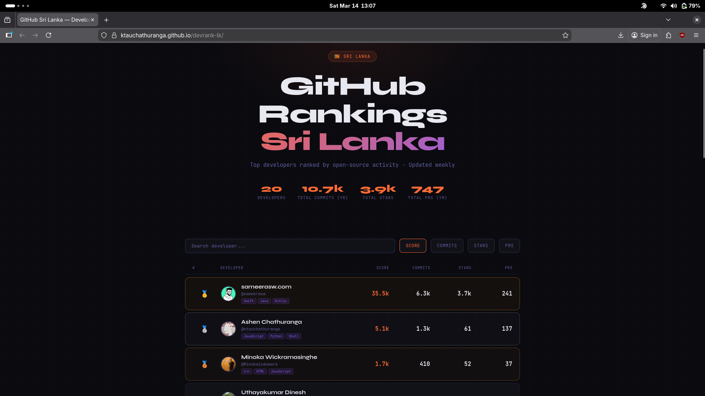

# GitHub Sri Lanka — Developer Rankings 🇱🇰 

A weekly-updated leaderboard of Sri Lankan GitHub developers, ranked by open-source activity.

<p align="center">
  
  <br>
  <em></em>
</p>

> [!NOTE]  
> **Live site →** [devrank-lk](https://ktauchathuranga.github.io/devrank-lk/)

> [!IMPORTANT]  
> **Disclaimer:** There is no objective way to "rank" developers. Every developer has a different workflow, tech stack, and focus area. If you are lower on this board, it doesn't mean you are a bad developer—it just means your open-source style is different. This leaderboard is just for fun! Happy coding!

---

## How it works

1. A list of Sri Lankan developers is maintained in [`data/users.json`](data/users.json)
2. Every Sunday, a GitHub Action runs a Python script that fetches each developer's stats via the GitHub GraphQL API
3. A `data/rankings.json` file is generated and committed
4. The static `index.html` reads `rankings.json` and renders the leaderboard

## Ranking Score

Developers are ranked by a composite score normalized to a **0–1000 scale** — the top developer always scores **1000**, and everyone else is scaled proportionally.

**Step 1 — Raw weighted score:**
```
raw = (commits × 3) + (PRs × 5) + (issues × 2) + (stars × 4) + (followers × 1)
```

**Step 2 — Normalize to 0–1000:**
```
score = round((raw / max_raw) × 1000)
```

| Metric | Weight | Notes |
|--------|--------|-------|
| Commits | × 3 | Current contribution year |
| Pull Requests | × 5 | Highest weight — collaboration matters most |
| Issues | × 2 | Community engagement |
| Stars | × 4 | Lifetime total across public repos |
| Followers | × 1 | Lowest weight |

---

## Add yourself to the rankings

1. Open the **Add yourself to DevRank LK** issue form:
   - [Open form](https://github.com/ktauchathuranga/devrank-lk/issues/new?template=add-yourself.yml)
2. Fill in your exact GitHub username (and optional note)
3. Submit the issue
4. A bot will automatically:
   - Validate your input
   - Create a PR that only updates `data/users.json`
   - Close your issue with a PR link
5. The PR is auto-validated and merged when checks pass

No manual JSON editing is required.

---

## Display Your Rank Badge

Developers on the leaderboard can embed a dynamic SVG badge in their GitHub profile `README.md` or personal site:

```markdown
[](https://ktauchathuranga.github.io/devrank-lk/)
```

Make sure to replace `<your-username>` with your exact GitHub handle!

---

## Setup (for repo owners)

### 1. Create a GitHub Personal Access Token

Go to **GitHub → Settings → Developer Settings → Personal Access Tokens → Fine-grained tokens**

Required scopes: `read:user`, `repo` (public only is fine)

### 2. Add it as a repository secret

Go to your repo → **Settings → Secrets and variables → Actions**

Create a secret named `GH_TOKEN` with your token value.

### 3. Enable GitHub Pages

Go to **Settings → Pages** → Source: `Deploy from branch` → Branch: `main` → Folder: `/ (root)`

### 4. Run manually to test

Go to **Actions → Update GitHub Rankings → Run workflow**

---

## Project structure

```
├── .github/
│   ├── ISSUE_TEMPLATE/
│   │   └── add-yourself.yml      # Contributor intake form
│   └── workflows/
│       ├── auto-merge.yml        # Validation + auto-merge for users.json PRs
│       ├── intake-users.yml      # Builds PRs from issue form submissions
│       └── update-rankings.yml   # Scheduled GitHub Action
├── data/
│   ├── users.json                # List of registered developers
│   └── rankings.json             # Auto-generated — do not edit
├── scripts/
│   └── fetch_data.py             # Fetches stats from GitHub API
├── index.html                    # The ranking page
└── README.md
```
